<p align="center">
  
</p>

<h1 align="center">ATSFlow</h1>

<p align="center"><b>AI resume optimization that gets you past the bots.</b> A CLI and API tool that parses your resume, scores it against ATS checks, tailors it to a specific job with Claude, and exports it in any format.</p>

<p align="center">
  <a href="https://nodejs.org/"></a>
  
  
  
  <a href="LICENSE"></a>
</p>

---

## Why

Most resumes are read by an **Applicant Tracking System** before a human ever sees them. ATSFlow checks your resume the way an ATS would, then uses Claude to tailor it to the exact job you're applying for — raising your match without inventing anything.

## What it does

<p align="center">
  
</p>

| Command | What it does |
|---|---|
| `generate` | AI summaries, cover letters and job descriptions |
| `analyze` | 30+ ATS compatibility checks, scored, with fixes |
| `parse` | extract structured data from PDF / DOCX resumes |
| `tailor` | rewrite a resume to match one job posting |
| `export` | PDF · DOCX · TXT · JSON · HTML |
| `benchmark` | skills-gap analysis against an industry or role |
| `versions` | track and diff resume versions |

Everything runs from the CLI or the API server, so it drops neatly into Claude Code or any automation.

## Quick start

```bash
git clone https://github.com/ry-ops/ATSFlow.git
cd ATSFlow
npm install
chmod +x cli.js            # Unix/macOS

node cli.js help
```

A few commands:

```bash
node cli.js analyze resume.pdf --output analysis.json           # ATS score + fixes
node cli.js tailor resume.json job-description.txt --output tailored.json
node cli.js export resume.json pdf --output resume.pdf
node cli.js benchmark resume.json --industry tech
```

**As an API server:**

```bash
npm start        # http://localhost:3000
```

See [API_DOCUMENTATION.md](API_DOCUMENTATION.md) for the HTTP endpoints, and [QUICK_REFERENCE.md](QUICK_REFERENCE.md) for the full command list.

## How tailoring works

1. **Parse** your resume into structured data.
2. **Analyze** it against the ATS checks for a baseline score.
3. **Tailor** — Claude rewrites bullet points and the summary to reflect the job's language and required skills, keeping everything truthful.
4. **Re-score and export** in the format you need.

You stay in control: tailoring can show a **diff** before anything is applied.

## Docs

ATSFlow ships with deep docs — architecture, the template system, document generation, testing and more — in the Markdown files at the repo root (start with [QUICK_REFERENCE.md](QUICK_REFERENCE.md) and [ARCHITECTURE_CATALOG.md](ARCHITECTURE_CATALOG.md)).

## License

MIT. See [LICENSE](LICENSE).

<!-- org-footer -->
---

<p align="center"><sub>Part of <a href="https://github.com/ry-ops">ry-ops</a> · building the pipes between infrastructure, automation, and observability · built by <a href="https://github.com/ry-ops">ry-ops</a></sub></p>
